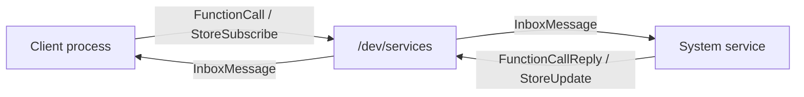
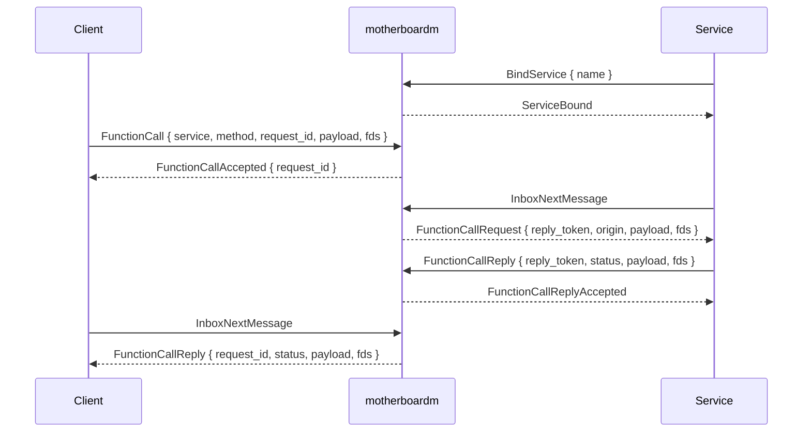
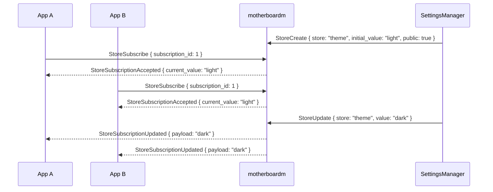

<h1 align=center><code>motherboard</code></h1>

motherboardm is a kernel-backed service bus for Linux, built for fast IPC between applications and system services.

It is designed for the operating-system shape where normal applications talk to
privileged or semi-privileged system services through one shared transport.

`motherboard` has a lot of improvements over raw unix sockets:

- **Better IPC primitives:**
    - Atomic messages instead of raw byte streams
- **Async RPC**
    - Uses fence/latch file descriptors which can be used with `poll` syscall, making it easy to integrate with async runtimes like `tokio`
    - Inline file descriptor passing: file descriptors are included with the message along side the main payload so you never correlate the wrong file descriptor with the wrong message frame like it could happen with unix sockets.
    - Kernel-attested caller identity metadata: the server implementing the service just knows who called it because it comes directly from the kernel, the caller can never forge it even if it is inside a user/pid namespace or a container.
- **OS-level dependency injection**
    - Apps do not know what process is implementing what service, allowing the implementation (server) to be swapped out entirely without breaking anything
- **Reactive state and state management**
    - **Stores**: Services can contain stores which are variables which contain reactive data and can be watched and read by clients. Whenever the server updates the store's value, everyone is notified automatically.
    - **Anonymous stores**: Can be read and watched just like normal stores, but don't have a name and can be created, returned and destroyed on-the-fly by service functions.
- **Signals** allow clients to receive events from services like for example when the user clicks on a button on a notification the app sent earlier. (not implemented yet)


The current userspace entry point is `/dev/services`, where consumers need to open it and send serialized commands using [postcard](https://github.com/jamesmunns/postcard) through `ioctl` syscall.

> Status: early prototype. This is kernel code, and panics or incorrect unsafe
> code can crash the running system. Develop and load it carefully.

## Proof of Concept

The settings app proof of concept demonstrates the full flow:


https://github.com/user-attachments/assets/f2569c94-2d06-4223-8f0b-f4e80c27efeb


This video shows a settings app calling a setter function and both apps reacting to state changes in the settings service automatically.

## Local Benchmark

These numbers were measured on a development laptop with the CPU set to
performance mode. Each benchmark used one service process and one client process,
10,000 measured round trips, 100 warmup round trips, an empty payload, and
sequential request/reply calls over a persistent connection.

| Transport | Throughput | Avg | P50 | P90 | P99 |
| --- | ---: | ---: | ---: | ---: | ---: |
| `motherboardm` | 117,603.71 round-trips/sec | 8.48 us | 6.34 us | 13.40 us | 16.04 us |
| D-Bus, best of 3 | 30,203.18 round-trips/sec | 33.06 us | 29.08 us | 43.15 us | 78.16 us |

In this run, `motherboardm` was about 3.9x higher throughput than D-Bus, with
about 3.9x lower average latency and 4.6x lower median latency. The D-Bus
comparison used `dbus-daemon` through `dbus-run-session` and a Rust
`dbus`/`dbus-crossroads` service implementing a `Ping(Vec<u8>) -> Vec<u8>`
method.


## Why

Unix domain sockets already solve a lot of IPC problems, in fact, most of linux is implemented using them. But they expose a
network-style stream/datagram model and require service protocols to rebuild
the same transport concerns repeatedly: framing, request IDs, async wakeups,
credential lookup, and `SCM_RIGHTS` fd passing.

Not only that, but they usually force applications to be coupled to specific daemons and service implementations preventing
the OS from being future-proof and evolve without breaking existing applications, and they just turn your operating system into a complex distributed system
resembling Netflix infrastructure.

`motherboardm` moves those concerns into one kernel-backed bus:



Services are opaque interfaces which privileged processes (servers) can provide implementations of.

Servers receive information about who called a specific function and allow them to apply their own policies and return errors whenever it thinks
the caller is not entitled to do a certain action.

Servers may implement one service or multiple services at once, this allows the server to be swapped entirely or split into multiple processes
and joined back into one without breaking the interface.

This is highly inspired by android where a lot of android java APIs actually map to calling remote functions from privileged system components and daemons such as when you ask for permissions, use startActivity to switch screens, send notifications or register services. motherboardm aims to help implement this pattern.

## Repository Layout

```text
.
├── Cargo.toml                         # userspace workspace
├── client/                            # Userspace Rust client library and examples
├── docs/                              # Design notes
├── motherboard-ardos-ui-integration/  # Ardos UI integration helpers
├── motherboardm/                      # Rust Linux kernel module
├── proof-of-concept/                  # End-to-end demos
└── protocol/                          # Shared command, reply, and message types
```

The parent Cargo workspace contains the userspace crates. `motherboardm` is
excluded from that workspace because kernel modules are built with `cargo-nok`,
but it still imports the shared `protocol` crate.

## Protocol Model

The shared protocol lives in `protocol/src/commands.rs`.

The core function-call flow is:

1. A service opens `/dev/services` and sends `BindService { name }`.
2. A client opens `/dev/services` and sends `FunctionCall { service, method,
   request_id, payload, fds }`.
3. The kernel queues a `FunctionCallRequest` in the service inbox and returns
   `FunctionCallAccepted { request_id }` to the client.
4. The service repeatedly calls `InboxNextMessage`.
5. If work is available, `InboxNextMessage` returns `FunctionCallRequest {
   reply_token, origin, payload, fds, ... }`.
6. If no work is available, the command returns `WouldBlock { latch_fd }`;
   userspace polls the latch fd and then fetches again.
7. The service replies with `FunctionCallReply { reply_token, status, payload,
   fds }`.
8. The client receives `FunctionCallReply { request_id, status, payload, fds }`
   through its own inbox.

The `reply_token` is kernel-issued and single-use. It prevents a service from
replying to the wrong client or forging a reply to a request it was never given.



## Stores

Stores are service-owned retained values. Clients subscribe to stores and then
receive the current value plus every later update in their inbox.

The store command flow is:

1. A service sends `StoreCreate { service, store, initial_value, public }`.
2. A client sends `StoreSubscribe { service, store, subscription_id, payload }`.
3. For public stores, the kernel immediately queues
   `StoreSubscriptionAccepted { current_value, ... }` in the client's inbox.
4. For private stores, the service receives `SubscribeRequest` and replies with
   `StoreSubscriptionReply`.
5. When the service sends `StoreUpdate`, every subscribed client receives
   `StoreSubscriptionUpdated`.



`SubscriptionId` values are unique per open `/dev/services` connection. The
kernel stores subscriptions by both the connection id and the subscription id,
so two clients can both use `SubscriptionId(1)` without colliding.

## Latch FDs

`motherboardm` avoids blocking inside the ioctl itself.

When an inbox is empty, `InboxNextMessage` returns:

```rust
TransportError::WouldBlock { latch_fd }
```

That `latch_fd` is a temporary, one-way readiness object:

- userspace polls it for readability;
- the kernel trips it when new inbox work arrives;
- once tripped, it stays readable forever;
- userspace should close it and call `InboxNextMessage` again.

This makes the transport friendly to `poll`, `epoll`, and async runtimes without
requiring every process to spin in a busy loop.

## File Descriptor Passing

File descriptors are carried inline in protocol messages:

```rust
Command::FunctionCall {
    service,
    method,
    request_id,
    payload,
    fds,
}
```

At send time, the kernel resolves each sender fd into an `ARef<File>`. At fetch
time, the kernel reserves fd numbers in the receiver process and installs those
files there. From userspace, the receiver sees ordinary fd numbers and can wrap
them in `std::fs::File`, `OwnedFd`, or whatever abstraction is appropriate.

This is similar in spirit to `SCM_RIGHTS`, but it is part of the typed
motherboard message envelope instead of ancillary socket control data.

## Building

This repository uses [`cargo-nok`](https://github.com/ardos-os/cargo-nok), a Cargo plugin for building Rust Linux
kernel modules without Linux's legacy Makefile build infrastructure.

First, install `cargo-nok` if you haven't already:
```bash
cargo install --git https://github.com/ardos-os/cargo-nok
```

Then, make sure you have the `linux-headers` package for your target kernel, this is required for building any kind of module.
`cargo-nok` scrapes important information and uses tools from your linux-headers so it can build the kernel module targetting your kernel correctly.

Build the kernel module:

```bash
cd motherboardm
cargo nok build
```

The resulting module is written under:

```text
motherboardm/target/target/debug/motherboardm.ko
```

Check the userspace client and examples:

```bash
cargo check --workspace
```

Format all Rust crates:

```bash
cargo fmt --manifest-path protocol/Cargo.toml
cargo fmt --manifest-path client/Cargo.toml
cargo fmt --manifest-path motherboard-ardos-ui-integration/Cargo.toml
cargo fmt --manifest-path motherboardm/Cargo.toml
```

## Running The Examples

The examples live in `client/examples`.

Start the service in one terminal:

```bash
cd client
cargo run --example server
```

Run the client in another terminal:

```bash
cd client
cargo run --example client
```

The current example demonstrates fd passing:

1. the client creates a temporary file;
2. the client sends the file descriptor to `EchoService`;
3. the server receives a new fd installed in its process;
4. the server reads the file and replies with its contents.

Expected client output includes:

```text
submitted requests [RequestId(1)]
server read: hello through an installed file descriptor
```

If `/dev/services` is not present, the kernel module is not loaded. Loading and
unloading modules requires root privileges and should be done carefully:

```bash
cd motherboardm
cargo nok load
cargo nok unload
```

## Userspace API

The `motherboard-client` crate provides a small synchronous wrapper around the
ioctl protocol.

Here's an example of a simple RPC call to an `EchoService`

```rust
use motherboard_client::{ClientApi, ClientCallsApi, MotherboardClient};

let bus = MotherboardClient::open()?;
let request_id = bus.client().calls().call(
    "EchoService", // service name
    "echo", // function name
    b"hello".to_vec(), // payload bytes
    Box::<[u32]>::default(), // file descriptors, in this case none
)?; // calls EchoService.echo("hello")

loop {
    match bus.client().fetch() {
        Ok(message) => {
            println!("{message:?}");
            break;
        }
        Err(motherboard_client::ClientError::WouldBlock(latch_fd)) => {
            // poll/epoll latch_fd, then fetch again
            drop(latch_fd);
        }
        Err(error) => return Err(error.into()),
    }
}
```

With the optional `tokio` feature, the client crate also exposes
`fetch_async()` which uses tokio's reactor to await the latch file descriptor automatically.

## Ardos UI Integration

The `motherboard-ardos-ui-integration` crate bridges stores into Ardos UI. It
owns one motherboard connection and dispatcher thread through `MotherboardUi`,
and exposes a hook for subscribing to stores:

```rust
use motherboard_ardos_ui_integration::{MotherboardUi, use_motherboard_store};

let motherboard = ardos_ui::use_memo(
    || MotherboardUi::open().expect("failed to open /dev/services"),
    (),
);

let theme = use_motherboard_store(
    (*motherboard).clone(),
    "SettingsManager",
    "theme",
);
```

The hook returns `Option<Arc<[u8]>>`: `None` means the first snapshot has not
arrived yet, and `Some(value)` is the latest retained store value. Cloning the
value only bumps an `Arc` reference count.

## License

See [LICENSE](LICENSE) file.
