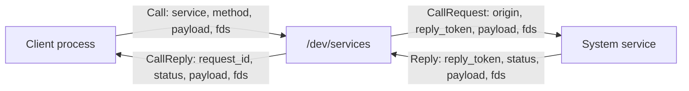
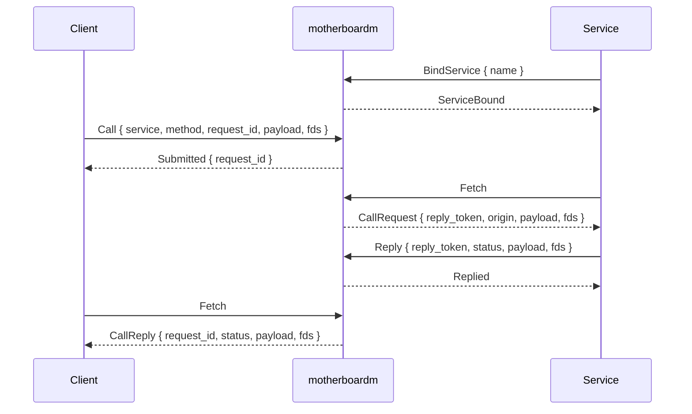

# motherboardm

`motherboardm` is an experimental Linux kernel module that provides a virtual
system bus for local services.

It is designed for the operating-system shape where normal applications talk to
privileged or semi-privileged system services through one shared transport:

- block-oriented messages instead of byte streams
- async request/reply inboxes
- pollable one-shot latch file descriptors
- inline file descriptor passing
- kernel-attested caller identity metadata

This is highly inspired by android where a lot of android java APIs actually map to calling remote functions from privileged system components and daemons such as when you ask for permissions, use startActivity to switch screens, send notifications or register services. motherboardm aims to help implement this pattern.

The current userspace entry point is `/dev/services`.

> Status: early prototype. This is kernel code, and panics or incorrect unsafe
> code can crash the running system. Develop and load it carefully.

## Why

Unix domain sockets already solve a lot of IPC problems, but they expose a
network-style stream/datagram model and require service protocols to rebuild
the same transport concerns repeatedly: framing, request IDs, async wakeups,
credential lookup, and `SCM_RIGHTS` fd passing.

Not only that, but they usually force applications to be coupled to specific daemons and service implementations preventing
the OS from being future-proof and evolve without breaking existing applications.

`motherboardm` moves those concerns into one kernel-backed bus:



Services still own policy and business logic. The module only transports
messages, preserves request/reply routing, installs file descriptors into the
receiving process, and attaches origin metadata that userspace cannot forge.

## Features

- **Atomic message blocks**: commands carry a complete serialized payload rather
  than a stream that needs delimiters or length headers.
- **Non-blocking inboxes**: `Fetch` returns either a message or
  `WouldBlock { latch_fd }`.
- **Pollable latch fds**: the latch fd becomes readable when new inbox work
  arrives, so services can integrate with `poll`, `epoll`, or async runtimes.
- **Inline fd passing**: messages can have `fds: Box<[RawFd]>` attached to them. the kernel
  clones the underlying `struct file` and installs a fresh fd in the receiver.
- **Origin attestation**: delivered requests include kernel-provided `pid`,
  `uid`, `gid`, and `is_trusted` metadata.
- **Postcard protocol**: command and reply envelopes are serialized with
  `postcard`, and the protocol crate supports `no_std` for kernel use.

## Repository Layout

```text
.
├── motherboardm/   # Rust Linux kernel module
├── protocol/       # Shared command, reply, and message types
└── client/         # Userspace Rust client library and examples
```

## Protocol Model

The shared protocol lives in `protocol/src/commands.rs`.

The core command flow is:

1. A service opens `/dev/services` and sends `BindService { name }`.
2. A client opens `/dev/services` and sends `Call { service, method,
   request_id, payload, fds }`.
3. The kernel queues a `CallRequest` in the service inbox and returns
   `Submitted { request_id }` to the client.
4. The service repeatedly calls `Fetch`.
5. If work is available, `Fetch` returns `CallRequest { reply_token, origin,
   payload, fds, ... }`.
6. If no work is available, `Fetch` returns `WouldBlock { latch_fd }`; userspace
   polls the latch fd and then fetches again.
7. The service replies with `Reply { reply_token, status, payload, fds }`.
8. The client receives `CallReply { request_id, status, payload, fds }` through
   its own inbox.

The `reply_token` is kernel-issued and single-use. It prevents a service from
replying to the wrong client or forging a reply to a request it was never given.



## Latch FDs

`motherboardm` avoids blocking inside the ioctl itself.

When an inbox is empty, `Fetch` returns:

```rust
TransportError::WouldBlock { latch_fd }
```

That `latch_fd` is a temporary, one-way readiness object:

- userspace polls it for readability;
- the kernel trips it when new inbox work arrives;
- once tripped, it stays readable forever;
- userspace should close it and call `Fetch` again.

This makes the transport friendly to `poll`, `epoll`, and async runtimes without
requiring every process to spin in a busy loop.

## File Descriptor Passing

File descriptors are carried inline in protocol messages:

```rust
Command::Call {
    service,
    method,
    request_id,
    payload,
    fds,
}
```

At send time, the kernel resolves each sender fd into an `ARef<File>`. At fetch
time, the kernel reserves fd numbers in the receiver process and installs those
files there. From userspace, the receiver sees ordinary fd numbers and can wrap
them in `std::fs::File`, `OwnedFd`, or whatever abstraction is appropriate.

This is similar in spirit to `SCM_RIGHTS`, but it is part of the typed
motherboard message envelope instead of ancillary socket control data.

## Building

This repository uses [`cargo-nok`](https://github.com/ardos-os/cargo-nok), a Cargo plugin for building Rust Linux
kernel modules without Linux's legacy Makefile build infrastructure.

First, install `cargo-nok` if you haven't already:
```bash
cargo install --git https://github.com/ardos-os/cargo-nok
```

Then, make sure you have the `linux-headers` package for your target kernel, this is required for building any kind of module.
`cargo-nok` scrapes important information and uses tools from your linux-headers so it can build the kernel module targetting your kernel correctly.

Build the kernel module:

```bash
cd motherboardm
cargo nok build
```

The resulting module is written under:

```text
motherboardm/target/target/debug/motherboardm.ko
```

Check the userspace client and examples:

```bash
cargo check --manifest-path client/Cargo.toml --examples
```

Format all Rust crates:

```bash
cargo fmt --manifest-path protocol/Cargo.toml
cargo fmt --manifest-path client/Cargo.toml
cargo fmt --manifest-path motherboardm/Cargo.toml
```

## Running The Examples

The examples live in `client/examples`.

Start the service in one terminal:

```bash
cd client
cargo run --example server
```

Run the client in another terminal:

```bash
cd client
cargo run --example client
```

The current example demonstrates fd passing:

1. the client creates a temporary file;
2. the client sends the file descriptor to `EchoService`;
3. the server receives a new fd installed in its process;
4. the server reads the file and replies with its contents.

Expected client output includes:

```text
submitted requests [RequestId(1)]
server read: hello through an installed file descriptor
```

If `/dev/services` is not present, the kernel module is not loaded. Loading and
unloading modules requires root privileges and should be done carefully:

```bash
cd motherboardm
cargo nok load
cargo nok unload
```

## Userspace API

The `motherboard-client` crate provides a small synchronous wrapper around the
ioctl protocol.

Here's an example of a simple RPC call to an `EchoService`

```rust
use motherboard_client::MotherboardClient;

let bus = MotherboardClient::open()?;
let request_id = bus.call(
    "EchoService", // service name
    "echo", // function name
    b"hello".into(), // parameters, the server and client can agree on any format for the parameters, it's just an array of bytes
    [].into(), // file descriptors, in this case none
)?; // calls EchoService.echo("hello")

loop {
    match bus.fetch() {
        Ok(message) => {
            println!("{message:?}");
            break;
        }
        Err(motherboard_client::ClientError::WouldBlock(latch_fd)) => {
            // poll/epoll latch_fd, then fetch again
            drop(latch_fd);
        }
        Err(error) => return Err(error.into()),
    }
}
```

With the optional `tokio` feature, the client crate also exposes
`fetch_async()` which uses tokio's reactor to await the latch file descriptor automatically.


## License

The kernel module declares a GPL module license.
